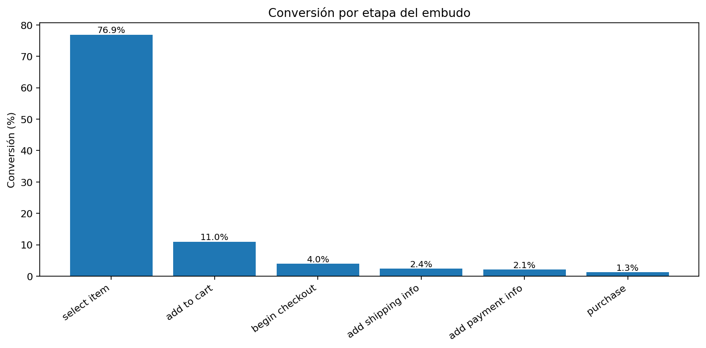
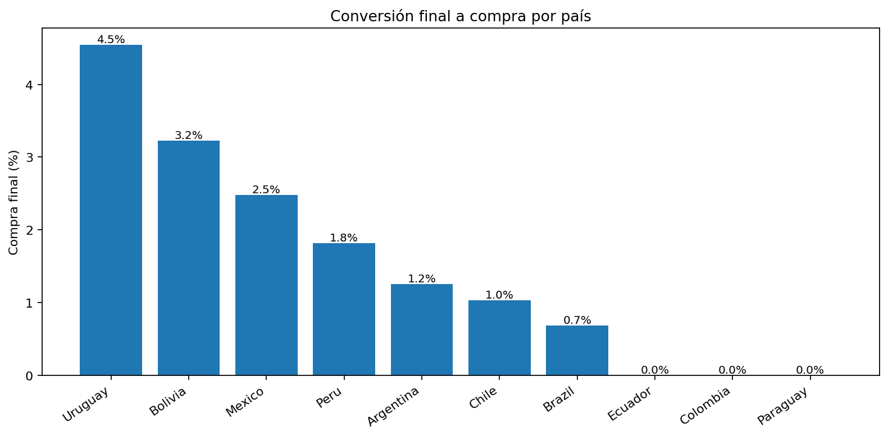
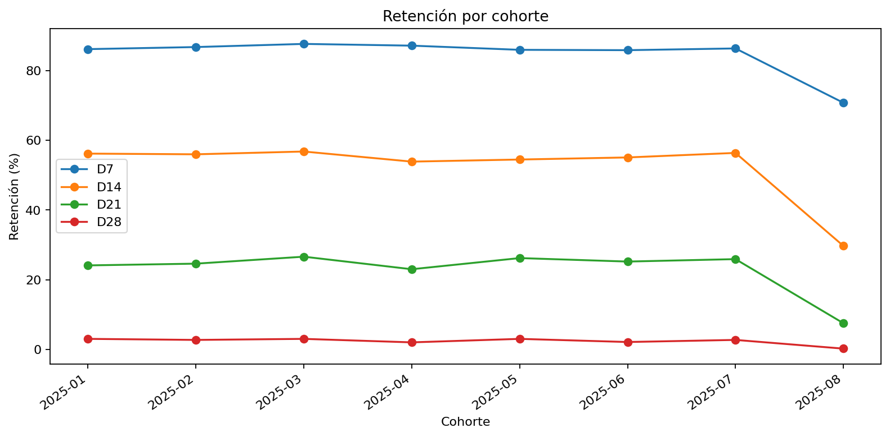
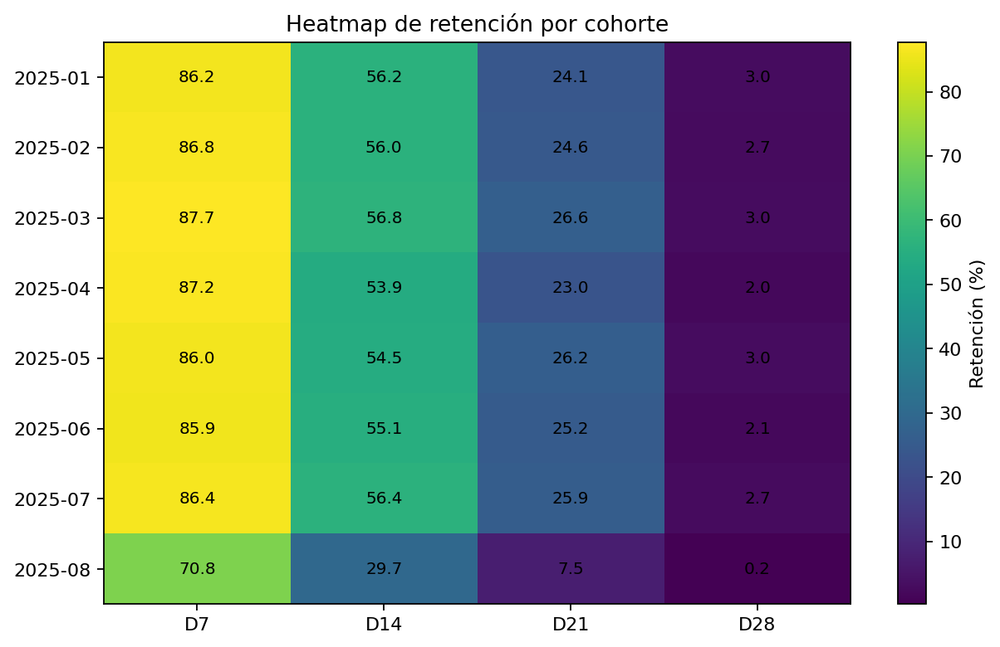

# Análisis de embudo y retención para MercadoLibre

Proyecto de análisis de datos enfocado en evaluar el desempeño del embudo de conversión y la retención de usuarios por país y cohorte.

## Objetivo

Identificar los principales puntos de fuga del embudo y analizar cómo evoluciona la retención de usuarios en ventanas D7, D14, D21 y D28 para generar recomendaciones accionables de negocio.

## Preguntas de negocio

- ¿Cuál es la tasa de conversión entre cada etapa clave del embudo?
- ¿En qué etapa se observa la mayor caída porcentual?
- ¿Cómo varía la conversión final por país?
- ¿Qué tan bien se retienen los usuarios a lo largo del tiempo?
- ¿Existen cohortes o países con comportamiento atípico?

## Dataset

El proyecto parte de un resumen ejecutivo en Excel con datos agregados de conversión y retención.

Periodo analizado del embudo: **01/01/2025 al 31/08/2025**.

## Estructura del repositorio

```text
mercadolibre-funnel-retention-analysis/
├── README.md
├── requirements.txt
├── .gitignore
├── data/
│   ├── raw/
│   │   └── proyecto_4_resumen_ejecutivo_original.xlsx
│   └── processed/
│       ├── funnel_general.csv
│       ├── funnel_by_country.csv
│       ├── retention_by_country.csv
│       └── retention_by_cohort.csv
├── notebooks/
│   └── funnel_retention_analysis.ipynb
├── outputs/
│   └── resumen_ejecutivo_mejorado_github.xlsx
├── images/
│   ├── funnel_general.png
│   ├── purchase_by_country.png
│   ├── retention_by_country.png
│   ├── retention_by_cohort.png
│   └── retention_heatmap.png
└── src/
    └── prepare_data.py
```

## Herramientas utilizadas

- Python
- Pandas
- Matplotlib
- Excel
- Jupyter Notebook

## Métricas principales

| Métrica | Resultado |
|---|---:|
| Conversión final a compra | 1.25% |
| Mayor caída del embudo | select_item → add_to_cart |
| Pérdida relativa de la mayor caída | 85.68% |
| Retención promedio D7 | 83.78% |
| Retención promedio D14 | 51.21% |
| Retención promedio D21 | 22.41% |
| Retención promedio D28 | 2.35% |

## Hallazgos clave

1. La mayor fuga del embudo ocurre entre **select_item** y **add_to_cart**, donde la conversión baja de **76.90%** a **11.01%**.
2. La conversión final promedio del embudo llega a **1.25%**.
3. Los países con mayor conversión final son **Uruguay (4.55%)**, **Bolivia (3.23%)** y **Mexico (2.48%)**.
4. **Ecuador, Colombia y Paraguay** presentan conversión final a compra de **0%** en el periodo analizado.
5. La cohorte de **agosto 2025** muestra una caída atípica: D7 baja a **70.80%** frente a un promedio previo de **86.60%**.

## Visualizaciones

### Conversión por etapa



### Compra final por país



### Retención por cohorte



### Heatmap de retención



## Recomendaciones

- Priorizar mejoras en el paso **select_item → add_to_cart**, ya que concentra la mayor pérdida relativa del embudo.
- Revisar países con conversión final nula para identificar fricción en pagos, logística, disponibilidad o instrumentación de eventos.
- Investigar la cohorte de agosto 2025, ya que muestra un deterioro fuerte en todas las ventanas de retención.
- Complementar este análisis con datos transaccionales o eventos de usuario para validar si las caídas se explican por comportamiento real o por problemas de medición.

## Cómo ejecutar el notebook

1. Clonar el repositorio.
2. Instalar dependencias:

```bash
pip install -r requirements.txt
```

3. Abrir el notebook:

```bash
jupyter notebook notebooks/funnel_retention_analysis.ipynb
```

## Nota

Este proyecto está preparado como caso de portafolio para un rol de **Data Analyst**, mostrando análisis de funnel, retención, cohortes, visualización y comunicación de hallazgos de negocio.
